<div align="center">

<!-- Animated header using capsule render -->


<!-- Status badge -->
[](https://github.com/Rahul-2806)
[](https://github.com/Rahul-2806)
[](https://github.com/Rahul-2806)

</div>

---

### `$ whoami`

```typescript
const rahul = {
  role       : "Full-Stack Developer",
  location   : "Kerala, India 🌴",
  currently  : "Building EcoBuddy — a smart waste management platform",
  stack      : ["Next.js 15", "Django REST", "Supabase", "TypeScript", "Python"],
  interests  : ["Web Experiences", "ML Applications", "Clean UI/UX"],
  status     : "Open to collaborations & freelance projects 🚀",
};
```

---

### 🛰️ Featured Projects

<div align="center">

| Project | Description | Stack | Status |
|--------|-------------|-------|--------|
| 🌿 **[EcoBuddy](https://github.com/Rahul-2806)** | Smart waste management platform with AI-powered routing & staff dashboards | `Next.js` `Django` `Supabase` | 🔨 In Progress |
| 🧠 **[Gridmind-Frontend](https://github.com/Rahul-2806/gridmind-frontend)** | ML model inference frontend with real-time TypeScript UI | `TypeScript` `React` | ✅ Public |
| 🧬 **[Gridmind-ML](https://github.com/Rahul-2806/gridmind-ml)** | Machine learning backend powering the Gridmind platform | `Python` `scikit-learn` | ✅ Public |
| 🌾 **[RiceGuard](https://github.com/Rahul-2806/riceguard-backend)** | Rice crop disease detection via computer vision | `Python` `OpenCV` `TypeScript` | ✅ Public |
| 📄 **[Portfolio Engine](https://rahul-2806.github.io/shajibennyresume)** | ATS-optimised resume + React SPA portfolio builder | `React` `Python` `ReportLab` | 🌐 Live |

</div>

---

### ⚡ Tech Stack

<div align="center">

**Frontend**


**Backend & Database**


**ML & DevOps**


</div>

---

### 📊 GitHub Stats

<div align="center">


</div>

<div align="center">


</div>

---

### 🌐 Let's Connect

<div align="center">

[](https://github.com/Rahul-2806)
[](https://rahul-2806.github.io/shajibennyresume)

</div>

---

<div align="center">


</div>
